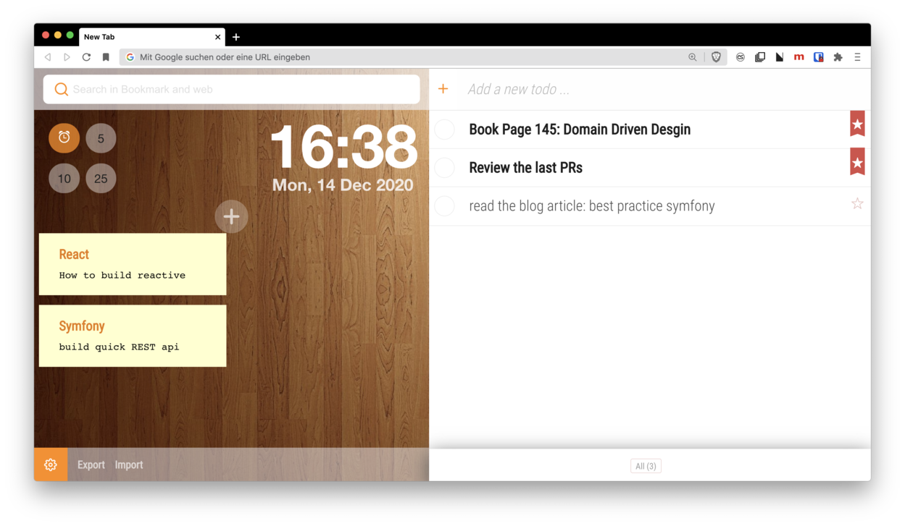

  <!-- Logo and title and sub-title -->
  
  <h1 style="font-weight: bolder; color: black; margin-top: 0px">
    NuTab
  </h1>
  <h3 style="color: darkgrey; margin: 40px 0"> 
    A chrome extension for enhance the new Tab
  </h3>

  <!-- description of project -->
  

  <strong>NuTab</strong> allows you to use integrated widgets such as Todo, Alerting, Notes and bookmarks, every time if you open a new tab in chrome.

  I build it to do some experiments with <strong>React and React hooks</strong>. Have a fun with it.
  

  <!-- github icons for PR and License -->
  

    
    
  

---

